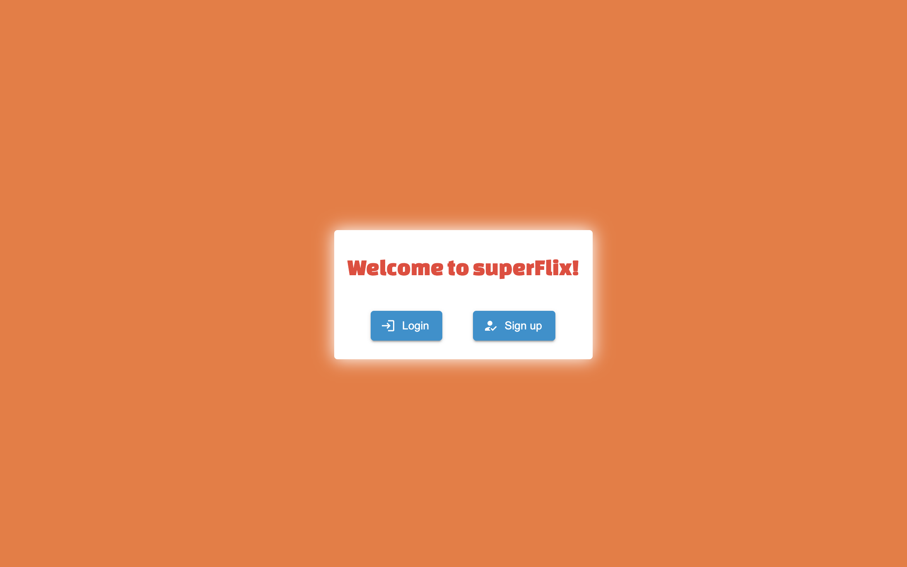
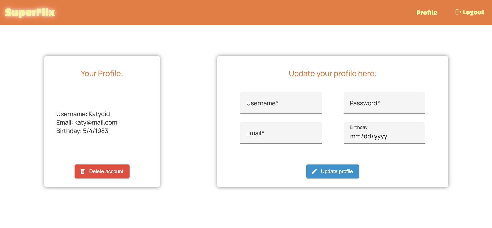

# SuperFlixAngularClient

## Intro

The client-side for an application called superFlix based on its existing server-side code (REST API and database), with supporting documentation.

This project was generated with [Angular CLI](https://github.com/angular/angular-cli) version 15.2.4.

## Key Features

- The app should display a welcome view where users will be able to either log in or register an account.
- Once authenticated, the user should now view all movies.
- Upon clicking on a particular movie, users will be taken to a single movie view, where additional movie details will be displayed. The single movie view will contain the following additional features:
  - A button that when clicked takes a user to the director view, where details about the director of that particular movie will be displayed.
  - A button that when clicked takes a user to the series view, where details about that
    particular series of the movie will be displayed.

## Technologies Used

TypeScript, Angular, TypeDoc

## Application Link

https://k8molony.github.io/superFlix-Angular-client/

## Development Server

Run `ng serve` for a dev server. Navigate to `http://localhost:4200/`. The application will automatically reload if you change any of the source files.

## Code scaffolding

Run `ng generate component component-name` to generate a new component. You can also use `ng generate directive|pipe|service|class|guard|interface|enum|module`.

## Build

Run `ng build` to build the project. The build artifacts will be stored in the `dist/` directory.

## Running unit tests

Run `ng test` to execute the unit tests via [Karma](https://karma-runner.github.io).

## Running end-to-end tests

Run `ng e2e` to execute the end-to-end tests via a platform of your choice. To use this command, you need to first add a package that implements end-to-end testing capabilities.

## Further help

To get more help on the Angular CLI use `ng help` or go check out the [Angular CLI Overview and Command Reference](https://angular.io/cli) page.

## App showcase

